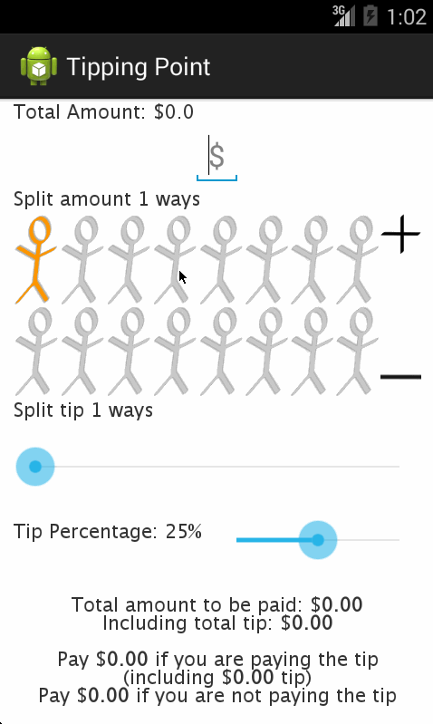

codepath-AdvTippingPoint  
========================    

Tip Calculator with optionals implemented.    

User Stories:  
1. The tip amount is automatically updated.  
2. Custom tip percentage can be selected using the tip percent seekbar.  
3. The total amount can be split multi-ways.  
4. The tip can also be split multi-ways. i.e. incase not everyone is paying the tip, 
	then total tip calculated will be distributed among others. Also ensured atleast 1 person pays the tip.  
5. All the variables are saved across launches.  
6. Widgets used: table, seekbar, textView, imageButton, editText.  
7. Stick figure images are created for selecting total amount split. When the total amount split spills over
    to more stick figures than shown, 10x stick figures are used to show the count.    

Walkthrough of the advanced tip calculator:  

GIF created with [LiceCap](http://www.cockos.com/licecap/).